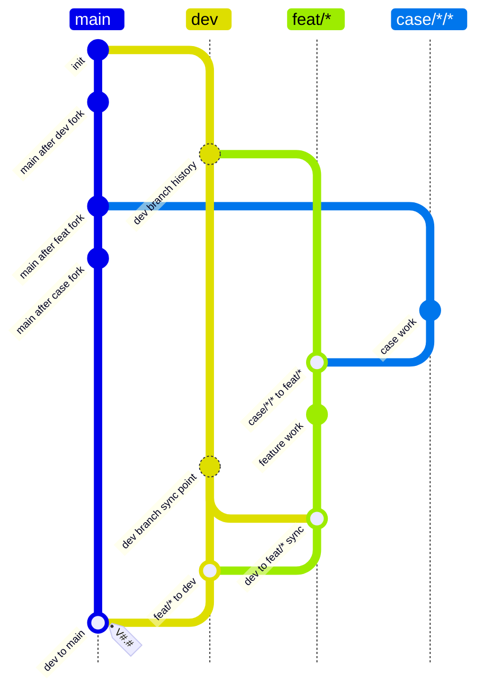

# Dev Feat Case Flow

## Rules

- `case/*/*` means `case/<context>/<topic>`, where `<context>` is a real project, customer, dataset, robot, deployment, or reproducible scenario.
- `case/*/*` branches from `main` and may merge only into `feat/*`.
- `case/*/*` must not merge directly into `dev` or `main`; reusable work must be distilled through `feat/*`.
- `feat/*` branches from `dev`.
- `feat/*` work must absorb the current `dev` and merge back to `dev`.
- `dev` is the integration branch and must not receive direct commits after the policy is installed.
- `main` may only receive tagged merges from `dev`.
- `main` release merge results must use a `V#.#` tag, where `#` means one or more decimal digits.
- `main` must not receive direct commits.
- Ad hoc tags are not allowed; release tags are allowed only when they satisfy the `dev` to `main` rule.
